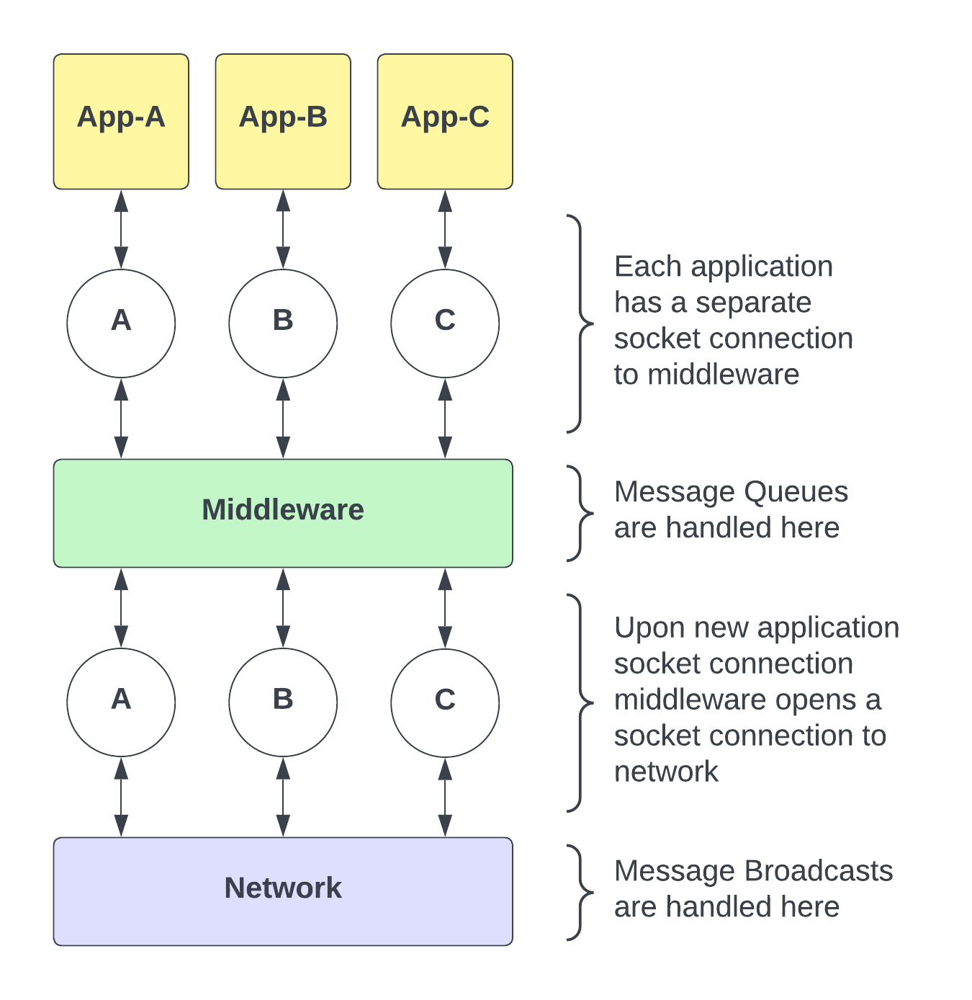
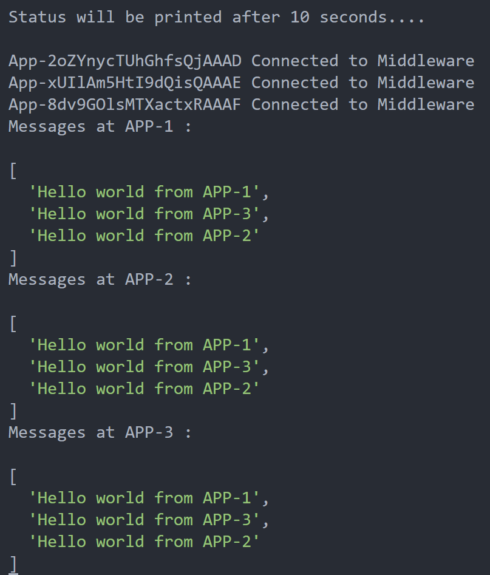
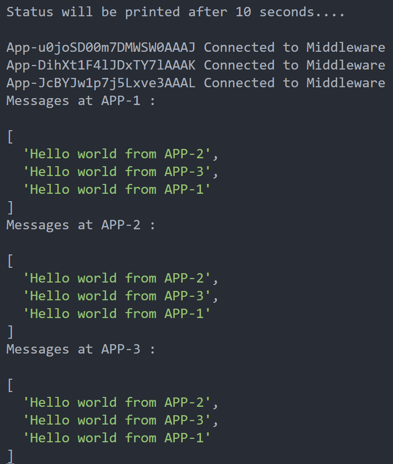
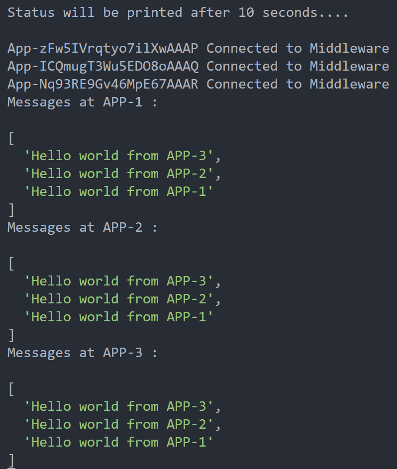
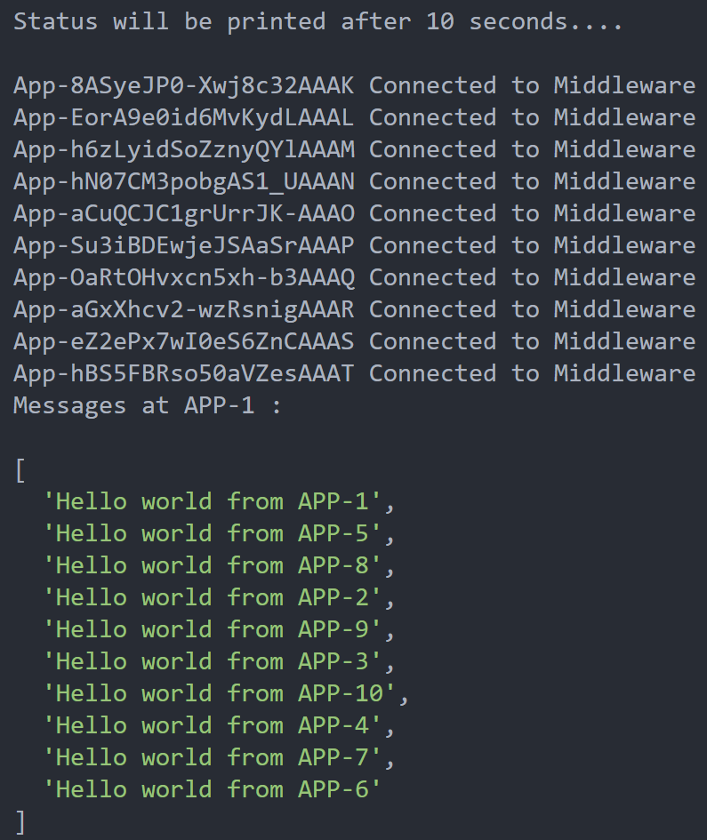
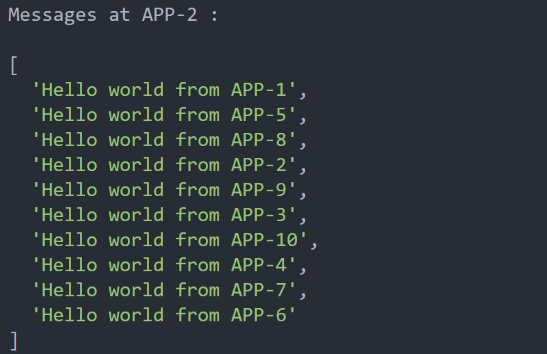
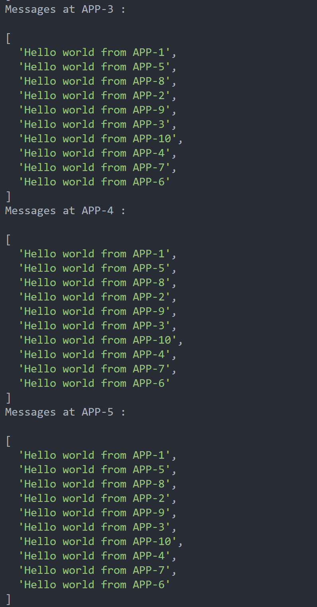
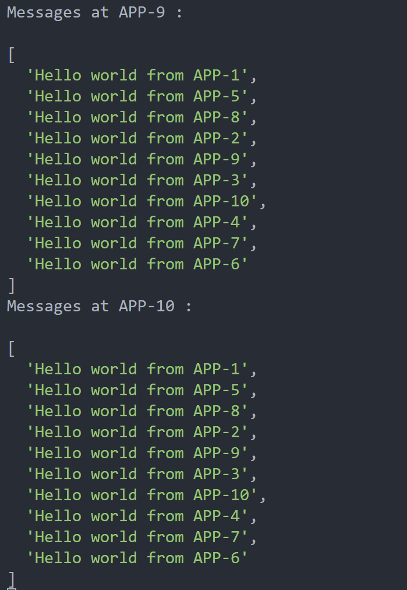

## Architecture

<p align="center">
    
</p>

- `socket.io-client:` Used for connecting to Socket.IO servers from a Node.js client.
- `express:` Used for building web applications and APIs in Node.js.
- `http:` A core module in Node.js used to create an HTTP server.
- `socket.io:` A library for enabling real-time, bidirectional, and event-based communication between web clients and servers using WebSockets or other transports.
- `crypto:` A core module in Node.js used for cryptographic operations. In this project, it's used to generate random UUIDs.

## Middleware - The Heart

#### What happens when a application connects to middleware ?

- When an application connects to the middleware through socket, it creates a new middleware instance which initializes a timestamp, queue to store messages, map to store acknowledgement counts and a socket connection to the network.
- An event listener is set up on the socket object. When the "broadcast_event" event is emitted from the application side, the `broadcast(data)` function will be invoked. This allows the application to use the broadcast functionality provided by the middleware.

  ```javascript
  socketServer.on("connection", (socket) => {
    console.log(`App-${socket.id} Connected to Middleware`);

    // A new middleware instance for every application socket
    const middleware = Middleware(socket);

    // Exposing API so that application can use broadcast of middleware
    socket.on("broadcast_event", middleware.broadcast);

    // Handle disconnection
    socket.on("disconnect", () => {
      middleware.disconnect();
      console.log(`App-${socket.id} Disconnected from Middleware`);
    });
  });
  ```

#### How can a application send a broadcast message ?

- Application provides a simple to use `send()` function which emits an event called `broadcast_event` to the middleware.
  (Refer to `send()` function in `app.js`)

- When a `broadcast_event` is received / triggered at middleware, The local timestamp is incremented and a JSON structure is formatted which contains all the necessary information. If a normal message is broadcasted the JSON contains the message content and a random id is assigned. If its an acknowledgement, we set ack flag to true and also include the id of the message for which acknowledgement is being sent. Then a `broadcast_event` is emitted to the network.
  (Refer to `broadcast(data)` function in `middleware.js`)

- Upon receiving a `broadcast_event` at network, it emits a `message` event to all the connected middleware sockets. Then the middleware is responsible for handling the message from network and delivering it to respective applications.
  (Refer to `server.js`)

#### How can a application recieve a message ?

- When the middleware receives a message from the network server, it triggers the `handleIncomingMessage` function. If the incoming message is an acknowledgment, it updates the acknowledgment count in the `acksMap`
- The middleware checks if front message in the queue can be delivered to the application. If the acknowledgement count of the message is equal to total no.of applications then we pop and send the message to application.

```js
// Whenever middleware sends message to application
middleSocket.on("message", (data) => {
  // add the message to outputCollector which is an array of all messages recieved at application
  outputCollector.push(data.message);
});
```

## Psuedo code

#### 1. Sending a broadcast_event from middleware to network

```js
function broadcast(data) {
  // Extract properties from data
  const { messageId, message, ack } = data;

  // 1. Increment the local timestamp
  timestamp = timestamp + 1;

  // 2. Prepare the data for broadcasting
  if (ack) {
    // 2a. If it is an acknowledgemnent, ack flag, id of the message being acknowledged
    // application id of the sender, and timestamp of the sender, here sender means the middleware(we)
    data = {
      ack,
      id: messageId,
      senderAppId: appSocket.id,
      senderTimestamp: timestamp,
    };
  } else {
    // 2b. If it is not an acknowledgement, generate a random id for the message,
    // application id of the sender, timestamp of the sender, and the content
    data = {
      id: randomUUID(),
      senderAppId: appSocket.id,
      senderTimestamp: timestamp,
      message: message,
    };
  }

  // 3. send the data to the network which broadcasts to all the applications
  networkSocket.emit("broadcast_event", data);
}
```

#### 2. Handling incoming broadcasted messages from network at middleware

```js
function handleIncomingMessage(data) {
  // 1. Extract message ID, timestamp, ack flag from incoming data
  const { id, senderTimestamp, ack } = data;

  // 2. update the local timestamp
  timestamp = Math.max(timestamp, senderTimestamp) + 1;

  // 3. If acknowledgment received
  if (ack) {
    // 3a. Update acknowledgment count for the message
    if (acksMap.hasOwnProperty(id)) acksMap[id]++;
    else acksMap[id] = 1;

    // 3b. Check if all acknowledgments received for the message on top of queue
    handleDeliverMessage();
    return;
  }

  // 4. If the messsage is not an acknowledgement

  // 4a. Add the data to the queue
  messageQueue.push(data);

  // 4b. Sort the message queue by timestamp and sender ID
  messageQueue.sort((a, b) => {
    if (a.senderTimestamp === b.senderTimestamp) {
      return a.senderAppId.localeCompare(b.senderAppId);
    }
    return a.senderTimestamp - b.senderTimestamp;
  });

  // 4c. Send acknowledgment for the message
  sendAck(id);
}
```

#### 3. Deliver message from middleware to application

```js
// This is executed when an acknowledgement is recieved
// Process messages in the queue
function handleDeliverMessage() {
  // 1. Deliver the message from front of queue to app only if all the acknowledgements have been recieved
  while (messageQueue.length > 0 && acksMap[messageQueue[0].id] == NUM_APPS) {
    // 2. Remove the message ID from acknowledgments map as we no longer need it after sending to application
    delete acksMap[messageQueue[0].id];
    // 3. Get and pop the message from the queue
    const data = messageQueue.shift();
    // 4. Deliver the message to the application
    appSocket.emit("message", data);
  }
}
```

#### 4. Broadcasting message to all middlewares from network

```js
socket.on("broadcast_event", async (data) => {
  await randomSleep(1000); // 1. Random delay for sending broadcast messages
  io.emit("message", data); // 2. This message event at middleware triggers handleIncomingMessage(data)
});
```

## Testing

- Refer `test.js`
- It imports the App class from a file named "app" and the constant NUM_APPS from a configuration file.
- It initializes an array named outputs which will hold the output of each app.
- It iterates NUM_APPS times, creating an instance of the App class for each iteration and passing the corresponding output array.
- It calls the send method on each app instance to trigger the sending of a message.
- It schedules the printing of the outputs array after 10 seconds using setTimeout.
- We can observe the order of messages recieved at every application is consistent.

#### Multiple Test runs with 3 Applications

<p align="center">
    <br>
    <br>
    <br>
</p>

#### Test with 10 Applications

<p align="center">
    <br>
    <br>
    <br>
    <br>
</p>
